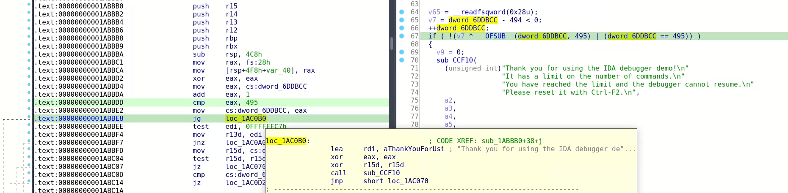

### IDA 7.5 Demo on Linux


This repository contains scripts to make leaked IDA 7.5 demo work on linux, tested on Ubuntu 22.04

You can find IDA 7.5 Demo installer on
http://fckilfkscwusoopguhi7i6yg3l6tknaz7lrumvlhg5mvtxzxbbxlimid.onion.pet/7.5/Demo/

or you can use [installer/idademo75_linux.run](installer/idademo75_linux.run) in the local repository
```bash
cd installer
./idademo75_linux.run
```

select the `/home/<user>/ida/idademo-7.5` as installation path

Features & limitations:

- [x] you have a local linux debugger & decompiler that does not use cloud services like in IDA freeware
- [ ] currently without ability to save database

### Installing

```bash
pip3 install frida
```

### Running

```bash
# cat is useful to pass input when debugging
./ida.py ~/ida/idademo-7.5/ida64 | cat
```

### How I removed limitations?

This project uses [frida](https://frida.re) (dynamic instrumentation toolkit for developers, reverse-engineers, and
security researchers) to edit assembly code of the program.

#### Sorry, the evaluation version has expired


```javascript
patch(ida64.add(0x27FD64), [0x90, 0x90, 0x90, 0x90, 0x90, 0x90]);
```

Modifying machine code (`jnz` (jump if not zero) will not jump to expired license block of code)
```
[ida64:000000000027FD64] jnz loc_27FFF8    => nop; nop; nop; nop; nop; nop
[ida64:000000000027FD64] 0F 85 8E 02 00 00 => 90 90 90 90 90 90
```

#### Sorry, the demo version will not disassemble itself


```javascript
patch(ida64.add(0x27C070), [0x90, 0x90, 0x90, 0x90, 0x90, 0x90]);
```

Modifying machine code (`jnz` (jump if not zero) will not jump to executable name check block of code)
```
[ida64:000000000027C070] jnz loc_27CFB8    => nop; nop; nop; nop; nop; nop
[ida64:000000000027C070] 0F 85 42 0F 00 00 => 90 90 90 90 90 90
```


```javascript
patch(libida64.add(0xBCD09), [0x90, 0x90, 0x90, 0x90, 0x90]);
```

Modifying machine code (`call` will not do internal safety check)
```
[libida64.so:00000000000BCD09] call _interr   => nop; nop; nop; nop; nop
[libida64.so:00000000000BCD09] E8 62 10 F8 FF => 90 90 90 90 90
```

#### Thank you for using the IDA debugger demo

Looks like they made a limit of 495 attempts to use the debugger



```javascript
patch(ida64.add(0x1ABBE8), [0x90, 0x90, 0x90, 0x90, 0x90, 0x90]);
```

Modifying machine code (`jg` (jump if >= 495) will not jump to error message)
```
[ida64:00000000001ABBE8] jg loc_1AC0B0     => nop; nop; nop; nop; nop; nop
[ida64:00000000001ABBE8] 0F 8F C2 04 00 00 => 90 90 90 90 90 90
```

### Sorry, copying huge amounts to clipboard is disabled in the demo

We wanna to delete this two conditions


```javascript
patch(ida64.add(0x170815), [0x90, 0x90]);
```

Modifying machine code (`jb` (jump if below) will not jump to "huge amounts of the selected text")
```
[ida64:0000000000170815] jb short loc_170824 => nop; nop
[ida64:0000000000170815] 72 0D               => 90 90
```


```javascript
patch(ida64.add(0x17081E), [0x90, 0xe9]);
```

Modifying machine code (`jbe` (jump if below or equal) will not jump to "huge amounts of the selected text")
```
[ida64:000000000017081E] jbe loc_170267    => nop; jmp loc_170267
[ida64:000000000017081E] 0F 86 43 FA FF FF => 90 E9 43 FA FF FF
```

After changing the code, this block of code has no way to start executing


### Sorry, you reached the limit of the decompilation attempts

They made an annoying big message that pops up every time, and I deleted it like this


```javascript
patch(hexx64.add(0x2276B), [0x90, 0x90]); //annoying message
```

Modifying machine code (`jz` (jump if zero) will not jump to annoying message block of code)
```
[hexx64.so:000000000002276B] jz short loc_227A0 => nop; nop
[hexx64.so:000000000002276B] 74 33              => 90 90
```


```javascript
patch(hexx64.add(0x22784), [0xeb]);
```

Modifying machine code (`jle` (jump if <= 100) will always jump to `loc_22796`)
```
[hexx64.so:0000000000022784] jle short loc_22796 => jmp short loc_22796
[hexx64.so:0000000000022784] 7E 10               => EB 10
```
